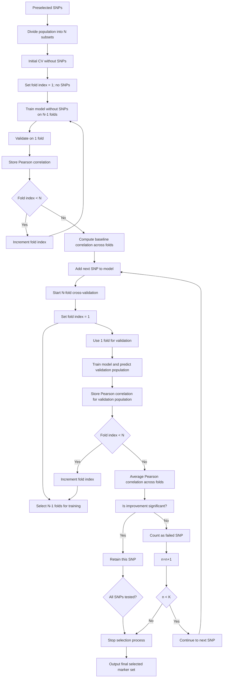

```mermaid
flowchart TD
    A["Preselected SNPs"] --> B["Divide population into N subsets"]
    B --> Z["Initial CV without SNPs"]
    Z --> Z1["Set fold index = 1; no SNPs"]
    Z1 --> Z2["Train model without SNPs on N-1 folds"]
    Z2 --> Z3["Validate on 1 fold"]
    Z3 --> Z4["Store Pearson correlation"]
    Z4 --> Z5{"Fold index &lt; N"}
    Z5 -- Yes --> Z6["Increment fold index"]
    Z6 --> Z2
    Z5 -- No --> Z7["Compute baseline correlation across folds"]
    Z7 --> D["Add next SNP to model"]
    D --> E["Start N-fold cross-validation"]
    E --> E1["Set fold index = 1"]
    E1 --> F1["Select N-1 folds for training"] & F2["Use 1 fold for validation"]
    F2 --> F3["Train model and predict validation population"]
    F3 --> F4["Store Pearson correlation for validation population"]
    F4 --> G1{"Fold index &lt; N"}
    G1 -- Yes --> G2["Increment fold index"]
    G2 --> F1
    G1 -- No --> H["Average Pearson correlation across folds"]
    H --> I["Is improvement significant?"]
    I -- Yes --> J["Retain this SNP"]
    I -- No --> K["Count as failed SNP"]
    J --> L["All SNPs tested?"]
    K --> n1["n=n+1"]
    M["Continue to next SNP"] --> D
    N{"n &lt; K"} -- No --> O["Stop selection process"]
    N{"n &lt; K"} -- Yes --> M
    O --> P["Output final selected marker set"]
    n1 --> N
    L --> O

    L@{ shape: diam}
```
