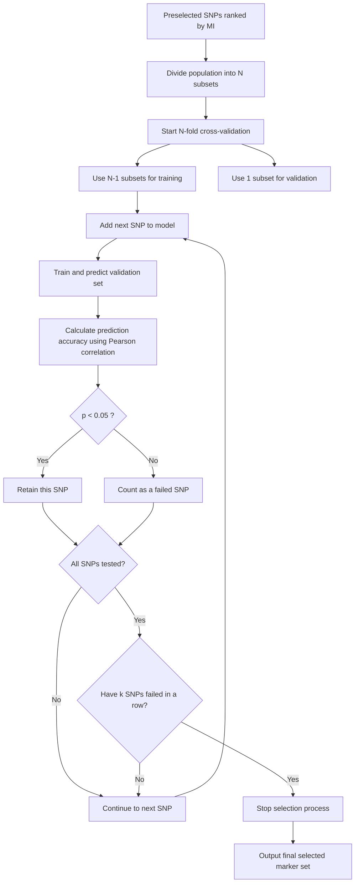

```mermaid
flowchart TD
    A[Preselected SNPs ranked by MI] --> B[Divide population into N subsets]
    B --> C[Start N-fold cross-validation]

    C --> D1[Use N-1 subsets for training]
    C --> D2[Use 1 subset for validation]
    D1 --> E[Add next SNP to model]
    E --> F[Train and predict validation set]
    F --> G[Calculate prediction accuracy using Pearson correlation]
    G --> H{p < 0.05 ?}

    H -- Yes --> I[Retain this SNP]
    H -- No --> J[Count as a failed SNP]

    I --> K{All SNPs tested?}
    J --> K

    K -- No --> L[Continue to next SNP]
    L --> E

    K -- Yes --> M{Have k SNPs failed in a row?}
    M -- Yes --> N[Stop selection process]
    M -- No --> L

    N --> O[Output final selected marker set]
```
